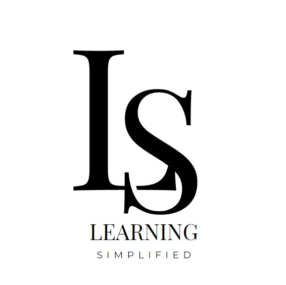

  <h1>c14-35-n-Java-React</h1>
  <h3>Learning simplified</h3>
  

 

**GitHub url:** [c14-35-n-java-react](https://github.com/No-Country/c14-35-n-java-react)

**Edtech** (tecnología educativa): Plataforma de entrenamiento en línea "Learning Simplified".

## Proyecto en desarrollo

Se lleva a cabo la construcción del backend y el frontend aparte y se conectarán mediante **RESTful API** _(proyecto abierto a cambios)_.

### Back-End Stack

Server: RESTful API.

 * MySql
 * Spring Boot 3
 * Java 17
 * Maven 3

### Front-End Stack

Client: Responsive Webpage.

 * React
 * NextJs (App router)
 * Typescript
 * Tailwind CSS
 * [**Daisy UI**](https://github.com/saadeghi/daisyui)

---

 

### Equipo

[desarrollo]

  

---
