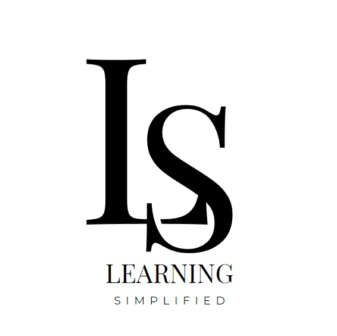
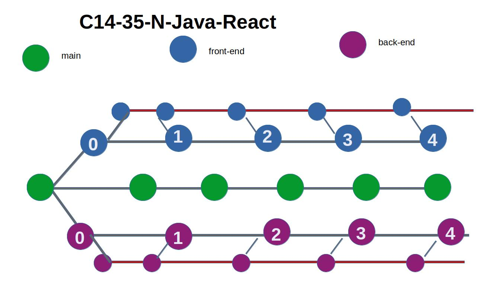

  <h1>c14-35-n-Java-React</h1>
  <h3>Learning simplified</h3>
  

 

**GitHub url:** [c14-35-n-java-react](https://github.com/No-Country/c14-35-n-java-react)

**Edtech** (tecnología educativa): Plataforma de entrenamiento en línea "Learning Simplified".

## Proyecto en desarrollo

Se lleva a cabo la construcción del backend y el frontend aparte y se conectarán mediante **RESTful API** _(proyecto abierto a cambios)_.

### Back-End Stack

Server: RESTful API.

 * MySql
 * Spring Boot 3
 * Java 17
 * Maven 3

### Front-End Stack

Client: Responsive Webpage.

 * React
 * NextJs (App router)
 * Typescript
 * Tailwind CSS
 * [**Daisy UI**](https://github.com/saadeghi/daisyui)

---

 

### Equipo

[desarrollo]

  
  
  
  
  
  
  
  
  

[comment]: <> ( Tubo euna participación en el proyecto, pero se retiró. )
[comment]: <> (  )
[comment]: <> (   )

 
### Contrib

# CONTRIBUTING.md

Debido a que el equipo de desarrollo de la webapp debe tener un sólo repositorio que contenga el tanto el 
front-end como el back-end, acordamos que para hacer el desarrollo más eficiente debe 
haber una rama que se enfoque únicamente al backend y otra al frontend 
_(el servidor y el cliente se crean en simultáneo)._

#### ramas principales

  

En el modo de desarrollo este repositorio consta de tres ramas principales, en donde se organiza el flujo de trabajo.

 * Una rama central `main` que contenga todo tanto el back-end _(./server)_ y el front-end _(./client)_.
 * Una rama que maneje exclusivamente el backend `backend-main`, donde se encuentra el proyecto **Spring Boot - Java - Maven**.
 * Una rama que maneja exclusivamente el frontend `frontend-main`, donde se encuentra el proyecto **React - NextJs - Typescript**.

Las ramas `backend-main` y `frontend-main` a su vez tienen sus ramas de pruebas de desarrollo `[branch]-dev`. 
na vez se haya alcanzado una version en la cual tanto el backend y el frontend se puedan comunicar mediante **RESTful API** 

Para las otras ramas son temporales donde se puede hacer push a las ramas de desarrollo de backend y frontend.

Aclarado lo anterior para participar en el proyecto solo son permitidas las aportaciones del equipo establecido.

### Clonar (ssh)

Ejemplo de clonar la rama específica:

 * backend: `git clone -b backend-dev git@github.com:No-Country/c14-35-n-java-react.git`.

 * frontend `git clone -b frontend-dev git@github.com:No-Country/c14-35-n-java-react.git`.
 

---
